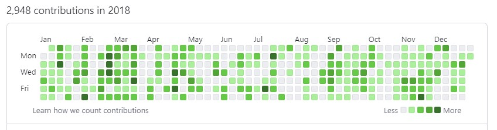

# GitCon - Your GitHub Commit Assistant

Created by Yigithan Saglam

Introducing an innovative way to display an organic GitHub activity! Let GitCon take care of your GitHub streaks in a remarkably natural pattern!

<p align="center">
  
</p>

<br>

GitCon is not your ordinary commit-bot. It doesn't just commit a specific number of changes every day. GitCon commits a randomly chosen number of times from your array each day, making your GitHub activity look as natural as possible.

This is a Bash script designed to run on your server or your local machine.

## Outstanding Features
- GitCon crafts a commit message with the current date and time.
- The bot adds a random number (between 0-6) of commits daily for an authentic-looking commit history.
- It offers an effortless setup with crontab scheduling for daily automatic execution.
- GitCon might choose not to make any commits on a given day to make your activity more organic!

## Quick Start Guide

Are you a Windows™ user? [Set up the Windows Subsystem for Linux](https://docs.microsoft.com/en-us/windows/wsl/install-win10)

Don't have git yet? [Get it here](https://github.com/git-guides/install-git)

**Step 1:** Fire up your terminal and go to the folder of your choice.

**Step 2:** Make a fork of this project on GitHub.

**Step 3:** Clone the forked project by substituting `<your-github-username>` with your actual GitHub username:

```bash
git clone https://github.com/<your-github-username>/activity-bot.git
```

**Step 4:** Run a test of the script. If you encounter permission issues, rectify them.

```bash
/bin/bash ./activity-bot/activity_bot.sh
```

**Step 5:** Set up a schedule for the script using crontab:

```bash
crontab -e
```

**Step 6:** Append the following line to schedule the script for execution daily at 1am:

```bash
0 1 * * * /bin/bash /<full-path-to-your-folder>/activity-bot/activity_bot.sh
```

Make sure to include the correct folder path.

## Important Points to Note

1. If you don't see any commits on a certain day, keep in mind that GitCon might choose not to make any commits on a given day. It's all part of giving your GitHub activity a genuine look!

Feel free to check out [Yigithan Saglam](https://github.com/ygthns) on GitHub.
